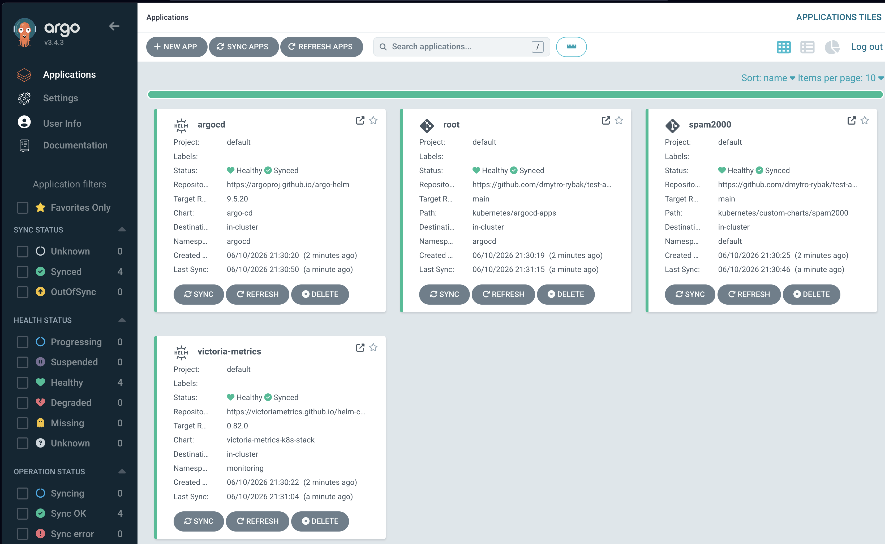
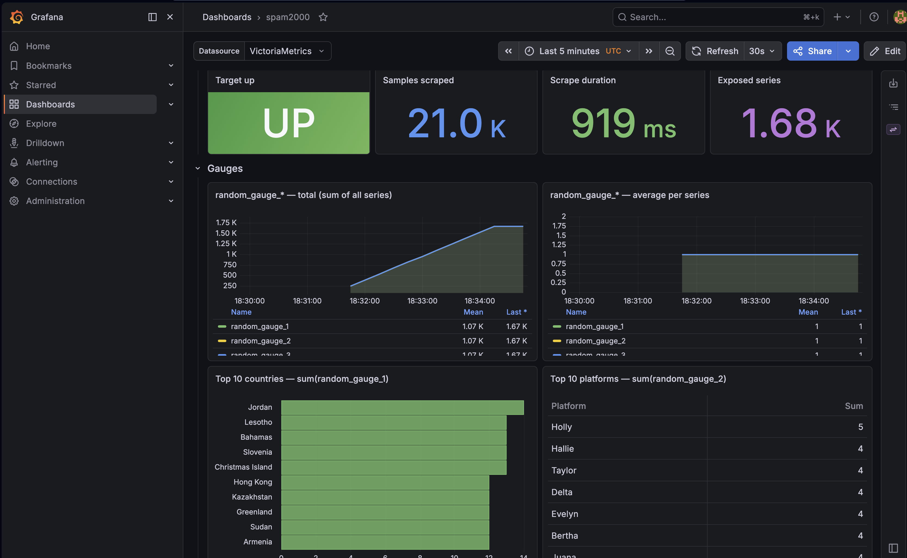
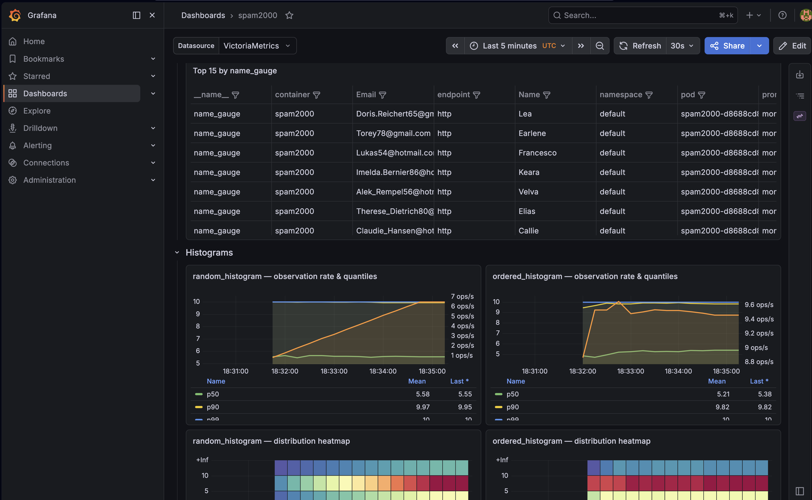

# test-assignment-universe-group

GitOps-managed local Kubernetes cluster running a sample metrics workload (`spam2000`) with VictoriaMetrics + Grafana monitoring.

## Stack

| Component | Role |
|-----------|------|
| minikube | Local Kubernetes cluster |
| Argo CD | GitOps controller |
| VictoriaMetrics | Metrics storage & scraping |
| Grafana | Dashboards |
| spam2000 | Sample metrics-emitting application |

## Prerequisites

- [Docker](https://docs.docker.com/get-docker/)
- [minikube](https://minikube.sigs.k8s.io/docs/start/)
- [kubectl](https://kubernetes.io/docs/tasks/tools/)
- [Helm](https://helm.sh/docs/intro/install/)
- make

## Quick start

```bash
make start
```

Starts the cluster, installs Argo CD, applies the app-of-apps, waits for Grafana to become ready, then opens port-forwards — all in one command. Press **Ctrl-C** to stop port-forwarding.

| Service | URL |
|---------|-----|
| Grafana | http://localhost:3001 |
| Argo CD | http://localhost:8081 |

```bash
make grafana-password   # Grafana credentials
make argocd-password    # Argo CD credentials
```

## Make targets

```
make start          # full setup + port-forwards (single entry point)
make bootstrap      # cluster + Argo CD + GitOps (no port-forward)
make forward        # port-forward only
make cluster-down   # stop cluster, preserve state
make cluster-delete # delete cluster entirely
make help           # list all targets
```

## GitOps flow

Argo CD watches this repository (`main` branch) with automated sync (`prune` + `selfHeal`). Any change merged to `main` is applied to the cluster automatically.

## Design notes

- etcd, kube-scheduler and kube-controller-manager monitoring is disabled: minikube binds their metrics endpoints to `127.0.0.1`, making them unscrapable without intrusive node-level workarounds.

---

## Screenshots

### Argo CD



### Grafana — spam2000 dashboard



